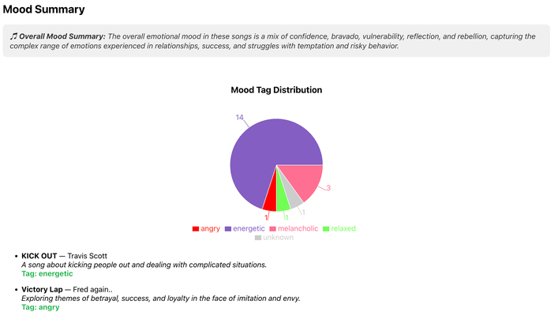
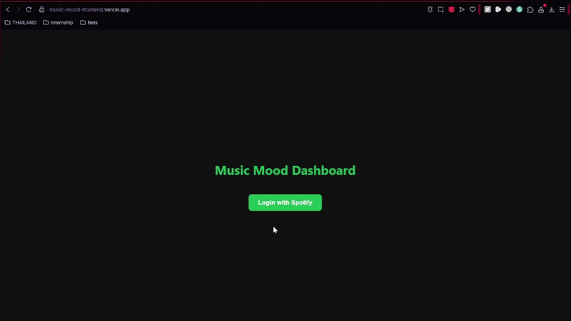

# Spotify Mood Dashboard

An AI-powered dashboard that analyzes the lyrics of your top 20 Spotify tracks to generate a personalized mood summary with interactive visualizations.

> Built to demonstrate full-stack development, API integration, and applied AI in a production-ready project.

[Live Demo](https://music-mood-frontend.vercel.app) | [Backend Repo](https://github.com/armaanbuxani/music-mood-backend)

---

## Project Preview



This summary is generated using sentiment analysis on lyrics pulled from Genius, based on your Spotify listening history.

---

## Features

- OAuth login with Spotify
- Fetches your top 20 tracks
- Retrieves lyrics via Genius API
- Applies sentiment analysis using OpenAI API 
- Displays data using visualizations and natural language summaries
- Responsive design

---

## How It Works

1. **Sign in** with your Spotify account  
2. **View your top 20 tracks**  
3. **Analyze mood and view the summary dashboard**  



---

## Tech Stack

### Languages
- Python (Backend)
- JavaScript / JSX (Frontend)

### Backend
- Flask (REST API)
- Spotipy + Requests (Spotify integration)
- ScraperAPI (Genius lyrics extraction)
- OpenAI API (Sentiment and mood analysis)
- Docker (Containerization)

### Frontend
- React (Component-based UI)
- Axios (HTTP requests)
- Recharts (Data visualization)
- CSS (Styling)

### DevOps & Deployment
- Git + GitHub (Version control)
- Render (Flask API deployment)
- Vercel (Frontend hosting)

### Other Tools
- OAuth 2.0 (Spotify authentication flow)
- Environment Variables (`.env` for credentials and configs)

---

## Setup Instructions

### 1. Clone this frontend repo
```bash
git clone https://github.com/yourusername/music-mood-frontend
cd music-mood-frontend
```

### 2. Install dependencies 
```bash
npm install
```

### 3. Set environment variables 
1. Copy the example environment file:
```bash
cp .env.example .env
```
2. Your .env file should now contain:
```env
REACT_APP_BACKEND_URL=https://music-mood-backend.onrender.com
```

---

> ⚠️ Note: Due to Spotify API restrictions, only users added to the Spotify Developer Dashboard can access the live demo.  
> If you'd like access to test the project, feel free to reach out — or you can clone the repo and use your own Spotify Developer credentials.

---

## What I Learned

This project gave me hands-on experience building a full-stack AI-integrated web application using real-world APIs. I learned to:
- Work with third-party services (Spotify, Genius, OpenAI)
- Handle OAuth 2.0 authentication
- Extract and preprocess lyrics for sentiment analysis
- Design clean, responsive UIs with data visualizations
- Deploy and connect backend/frontend using Render and Vercel
